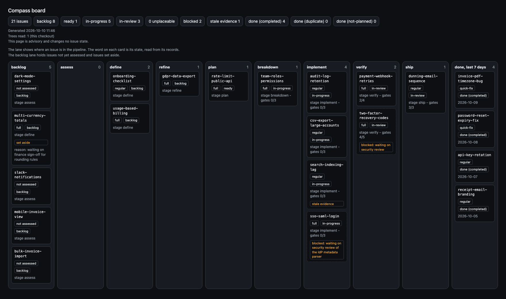

<p align="center">
  
</p>

# Compass

**Adaptive spec-driven development for Claude Code.**

[](https://github.com/ayeo-io/compass/actions/workflows/compass.yml)
[](https://docs.ayeo.io/compass/)
[](https://github.com/ayeo-io/compass/releases)
[](LICENSE)

> Enough process for the work at hand. No more.

A typo fix should not need an architecture pack. A payments rewrite should
not begin with an unstructured prompt.

Compass assesses each change by **risk, familiarity, size and goal**, then
composes the right delivery approach: the artifacts worth writing, the checks
worth running, the human decisions needed and the number of agents that can
work safely in parallel.

Assess the work. Let policy choose the process.

## Start here

Install Compass from inside Claude Code:

```text
/plugin marketplace add ayeo-io/compass
/plugin install compass@compass
```

Needs Python 3.10 or later. Compass CI tests Python 3.11.

Or from source:

```bash
git clone https://github.com/ayeo-io/compass.git
cd compass
bash scripts/install.sh --global
```

Add `bin/` to your `PATH` to make `compass` invokable, or call it as
`python3 cli/compass`. See [the installation smoke test](docs/install-smoke-test.md) for checks and
troubleshooting.

Then describe the work:

```text
/compass:assess "Add rate limiting to the public API"
```

Compass assesses the issue, works out the approach and tells you what needs
review next. The default guardrails work immediately; project setup is
optional.

Project settings, and a project's own changes to the shipped defaults, live in
one file, `compass.yml` ([docs/configuration.md](docs/configuration.md)).
`compass policy show` prints the configuration in force. Upgrading from 5.x?
Read [docs/upgrade-6-0-0.md](docs/upgrade-6-0-0.md). To mirror an issue's
labels on its GitHub issue, see [docs/github-labels.md](docs/github-labels.md).

Compass complements your normal CI. It does not replace tests, linting,
security scanning, builds or deployment checks.

Want the guided walkthrough? Read **[Compass in five minutes](docs/five-minutes.md)**.
Writing the artifacts is its own craft: see
[docs/writing-specs-and-plans.md](docs/writing-specs-and-plans.md).

## What Compass changes

Compass chooses the process for each change from its assessment of risk,
familiarity, size and goal. It adapts the depth without abandoning discipline.

| Work | Typical Compass response |
|---|---|
| **Quick fix** | One clear criterion, a focused change and evidence that it works. |
| **Regular** | Behavioural specification in Gherkin, proportionate technical design and review. |
| **Full** | intent document, architecture and delivery plan, with detailed design and test strategy only where useful. |
| **Hotfix** | Reproduce first, fix safely, then do the follow-up work skipped for speed (promote the reproduction to a scenario; optional postmortem). |
| **Spike** | Time-boxed exploration. Record the learning; ship nothing directly. |

These are reference shapes, not fixed levels. A one-file authentication change
can receive more protection than a large throwaway prototype because risk and
size are different things.

## Resumable and auditable

Every issue leaves a reviewable record. Its documents are in
`docs/compass/<created>-<issue>/`; its manifest, evidence and markers are in
`.compass/work/<issue>/`. The record holds:

- a dashboard showing the current decision and what needs approval;
- the delivery approach, including what was deliberately omitted and why;
- only the product, requirements, design, test and release artifacts justified
  by the work;
- traceable evidence behind each gate; and
- enough state for another session to resume without relying on chat history.

The terminal gives you the decision and the document to read. Detailed policy
output and test logs stay available as evidence rather than taking over the
conversation.

`compass board render` shows every issue on one page, with a lane for each
stage. Each card shows the issue's state, its delivery approach, its gates, and
any blocked or stale-evidence flag. This example is an invented invoicing
product:



## Rigour without ritual

Compass separates two things that process frameworks often confuse:

- **Guardrails** are few and checkable: tested before shipping, acceptance
  defined before implementation, traceability, evidence rather than
  assertion, and human approval for irreversible changes. `compass check`
  fails on a breach under enforced adoption, and the
  [safety contract](docs/safety-contract.md) lists what it cannot see.
- **Strategies** are strong defaults that improve the work without becoming
  bureaucracy: BDD, TDD, ADRs, visual architecture models and other practices
  that apply when they add value.

Judgement goes into the assessment. Everything after it is deterministic: the
same assessment plus the same policy produces the same approach, every time.

## One delivery language

```text
assess → define → plan → implement → verify → ship
```

The stages stay recognisable while their depth adapts. Each role enters the
same issue through its own command. For example, a product owner can start
upstream with `/compass:intent`; see the
**[roles guide](docs/roles-guide.md)** for the others.

## Built to port

Compass runs on Claude Code today, but its core is split deliberately:

- **Methodology:** plain-language guidance, governance and templates.
- **Kit:** the runtime-neutral Python CLI, schemas and policy engine.
- **Adapter:** the commands, agents, skills and hooks for Claude Code.

A future runtime adapter calls the same kit rather than reimplementing the
rules.

## The CLI

The slash commands are the pipeline; the CLI is the mechanism underneath them.
`/compass:assess` runs `compass approach evaluate`, `/compass:verify` runs
`compass check`. It is what makes the checks real rather than aspirational.

```text
compass init               make this directory a Compass project - create .compass/
compass approach evaluate  the assessment -> the delivery approach, deterministically
compass approach show      the three-line decision view: approach, gates, files
compass approach render    every delivery approach as one HTML table
compass bdd extract        acceptance criteria -> a runnable .feature
compass bdd verify         record which scenarios the runner actually ran
compass check              run the guardrail checks against the manifest and evidence
compass analyze            where an issue's artifacts disagree with each other
compass retro              is triage systematically over- or under-sizing the process?
compass retro --lineage    how many issues were found in another, and how many before it landed
compass issue raised-by    record the issue this one was found in, and where
compass spec sync          merge main, resolving only conflicts in the derived living spec
compass issue friction     record friction the agent observed, with evidence and a fix
compass ci                 the full mechanical gate suite, for continuous integration
compass tdd-red            run a test, assert it FAILS, record the red
compass tdd-green          run a test, assert it PASSES, record the green
compass policy lint        structurally validate the governance YAML
compass policy show        every resolved configuration field, with its source layer
compass preset init        scaffold a team preset repository
compass preset test        run a preset's fixtures and check its locks
compass review-rule list   the review rules that apply to the changed files
compass policy diff        compare two configurations: what one accepts that the other does not
compass policy migrate     turn copied governance and the old settings file into a compass.yml
compass policy update      move the project to another shipped default major, re-approving waivers
compass plan lint          scan a technical design for placeholder phrases
compass intent ingest      read a brief that already exists, by path or https URL
compass issue lint         structurally validate an issue manifest
compass issue receipt      one screen: assessment, approach, gates, evidence
compass issue diagnose     explain one run from its own records: stages, timeline, deviations
compass issue use          make an issue the current one, for this session
compass issue configure    propose, preview, discard or recover a change to one issue's own configuration
compass issue migrate      bring older issue directories up to the current schema; --config pins an issue's configuration to the installed check versions
compass issue dashboard render  the per-issue review page
compass issue artifact set set a document's status in the review pack
compass issue artifact-path  where one of an issue's documents is
compass issue template show  a document template with its checklists rendered from the stage lists
compass issue status set   backlog, or done with --close-reason completed | not-planned | duplicate
compass issue status remove  end a backlog hold; the state then follows the records
compass issue blocked set  flag an in-progress or in-review issue as blocked, with a reason
compass issue blocked remove  clear the blocked flag
compass issue link set     link an issue to its GitHub issue, to write its labels there (opt in)
compass issue labels sync  write an issue's labels to its linked GitHub issue now
compass issue subtask      record, resume and package a multiagent run's subtasks
compass acceptance start   open an honest record where there is no natural red
compass acceptance record  close it with what was observed
compass adr new            create the next numbered decision record
compass rework-scan        add-then-delete patterns across issues
compass flow               blockers, owed follow-ups, the periodic digest
compass board render       write the delivery board as one page and open it (--no-open, --out, --worktrees)
compass board refresh      rewrite that page in place, without opening a browser
compass next               which stage this issue reached, and what comes next
compass follow-up resolve  settle an owed follow-up
compass ship-commit        commit exactly the files the issue recorded
compass gate pass          mark a gate passed, validating the evidence type
compass scenario add       add a scenario to the manifest
compass scenario descope   record a failure mode no scenario covers, and why
compass scenario tests set replace the tests a scenario declares
compass changed-file add   trace a changed file to the scenario that asked for it
compass evidence add       append a typed evidence record
compass evidence approve   record a person's approval of a human check
compass evidence review    record a judgement against a judged check
compass terminology        what a term means here, from the frozen vocabulary
compass quick-fix start    assess, evaluate and record a quick fix in one call
compass quick-fix finish   trace, check, gate and ship a quick fix in one call
compass decision record    write a settled product decision; the decider comes from git
compass decision list      each decision's date, slug and outcome, newest first
compass decision show      print one decision
compass decision check     fail when a decision at a base ref was changed or removed
compass lesson add         record a project lesson now; who added it comes from git
compass lesson propose     hold a lesson for acceptance (the model's route)
compass lesson accept      turn a pending proposal into a lesson
compass lesson list        each lesson and each pending proposal
compass lesson remove      delete one lesson
compass lesson decline     drop a pending proposal; retro will not propose it again
compass run                run the implement or verify stage of one issue unattended (ADR-030)
compass record sync        copy the delivery record to its own repository (ADR-031)
compass record restore     bring the delivery record back into this project
```

Every verb describes itself - `compass <verb> --help` says what it does and
what the result means. This list gives one line per verb; `--help` gives the
detail.

## What the repository contains

```
commands/     the stage interface, under the /compass: namespace
agents/       distinct contexts - router, spec-author, planner, builder,
              verifier, reviewer, product-owner, product-marketer, architect
skills/       loadable procedures - adaptive-routing, bdd-specification,
              tdd-discipline, worktree-multiagent, intent-interview and the rest
hooks/        pre-tool.sh, post-tool.sh, stop.sh - mechanical enforcement
cli/compass   the kit: routing, checks and the manifest
bin/compass   the shim that puts the kit on your PATH
governance/   guardrails, strategies, routing policy, frozen vocabulary
approaches/   the reference shapes, and the artifacts each one earns
architecture/ Compass's own invariants and decision records
.claude-plugin/  the plugin manifest and marketplace entry
```

The first four are the Claude Code adapter and are rebuilt for another
runtime. Everything below them is reused unchanged.

## Five roles, one pipeline

Five roles, four of them non-engineering, each with its own entry point and
artifacts: engineer, product owner, designer, product marketer and QA. A
non-engineering entry point changes the delivery approach rather than adding a
consultation - see the [roles guide](docs/roles-guide.md).

## What Compass runs, sends and fetches

Compass works on your machine and in your repository. It reaches the network
only in the cases below, and each one starts only when you ask for it.

- **Fetches** a brief you name over HTTPS, with `compass intent ingest --from
  <url>`. It refuses any scheme but `https`, on redirects too.
- **Fetches** a git parent when the project's `extends:` names one
  (`github:<owner>/<repo>@<ref>#<sha>`). It runs `git` for the one pinned
  commit, reads its `compass.yml` as data, and caches it under
  `.compass/cache/parents/`. Only `compass policy lint`, `compass policy show`,
  `compass policy diff` (when a reference is a git parent), `compass policy
  update`, `compass preset test` and `compass approach evaluate --write` fetch,
  and only a commit that is not cached yet; never `compass check`. `compass
  policy update` always asks the remote which commit its ref names, unless
  `COMPASS_OFFLINE=1` is set. `--offline` or `COMPASS_OFFLINE=1` stops the others
  fetching. `COMPASS_PARENT_REMOTE_BASE`
  names a mirror in place of `https://github.com`. Git runs with your own git
  configuration, so your credential helper runs
  ([docs/git-parents.md](docs/git-parents.md)).
- **Sends** your delivery record to a git repository you configure, with
  `compass record sync`, which `compass ship-commit` also runs. It happens
  only when `compass.yml` (or `.compass/config.yml` in a project without one)
  names a `record:` remote; it redacts
  credentials, and rival product names when `record.names_key` is set.
- **Starts** host sessions (`claude -p`) with `compass run`, which sends their
  prompts through Claude Code as any session does. Those sessions may not push
  or merge.
- **Runs** commands on your machine: the test command you give `compass
  tdd-red`, `compass tdd-green` and `compass quick-fix finish`, your
  project's own guardrails declared with `check: command-passes`, git in your
  repository, and the CLI itself from the plugin's hooks.
- **Reads** the current Claude Code session's own transcript when a quick fix
  finishes, keeping only token counts, model names and times
  (`docs/headless-runner.md`).
- **Clones and installs** other frameworks only in the evaluation harness,
  `evals/harness.py`, which maintainers run by hand to compare conditions.

## Read next

- **[Five-minute walkthrough](docs/five-minutes.md):** install Compass and ship a small issue.
- **[Methodology](docs/methodology.md):** the design and reasoning behind adaptive delivery.
- **[Safety contract](docs/safety-contract.md):** what Compass guarantees and what it does not.
- **[Security](docs/security.md):** hooks, dependencies and the trust model.
- **[Portability](docs/portability.md):** how the methodology, kit and adapter fit together.
- **[Contributing](CONTRIBUTING.md):** what judges a pull request, and where to start.

## License

Apache 2.0. See [LICENSE](LICENSE).